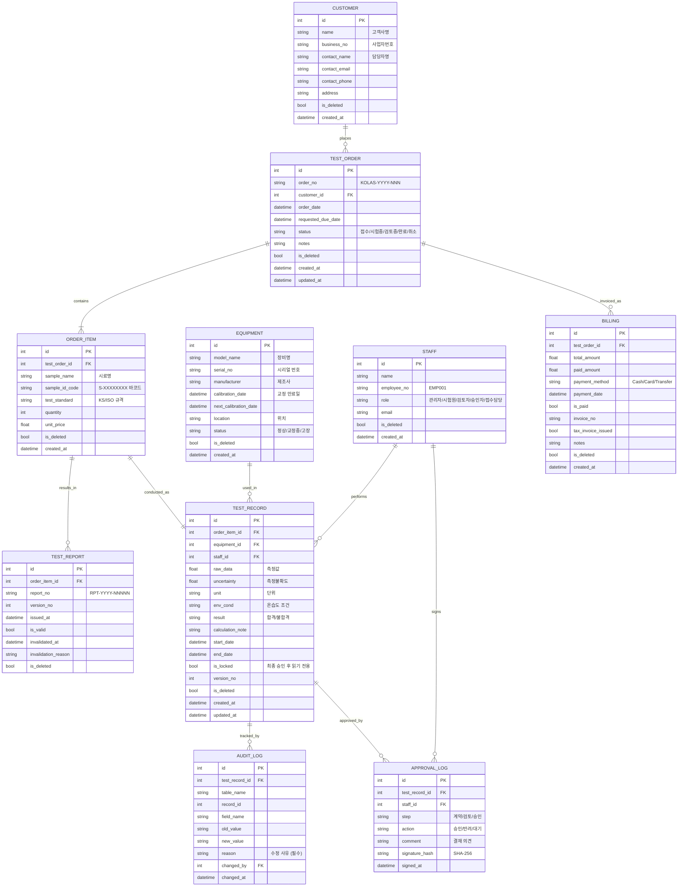

# K-LIMS 데이터베이스 설계 (ERD)

KOLAS 심사 시 핵심인 **누가(Who) · 언제(When) · 어떤 장비로(Which Equipment) · 어떤 기준(Standard)에 따라** 기록했는지를 구조화하는 데 초점을 맞춥니다.

---

## 1. ERD (Mermaid)



---

## 2. 테이블 명세 (Data Dictionary)

### 2.1 의뢰 및 시료 관리

| 테이블 | 역할 |
|--------|------|
| **CUSTOMER** | 고객사 기본 정보 및 담당자 연락처 |
| **TEST_ORDER** | 전체 의뢰 건에 대한 마스터 정보 |
| **ORDER_ITEM** | 하나의 의뢰 안에 여러 시료/시험 항목 (1:N) |

### 2.2 시험 수행 및 장비

| 테이블 | 역할 |
|--------|------|
| **TEST_RECORD** | **[핵심]** 측정값·불확도·환경 조건·합격판정 |
| **EQUIPMENT** | 교정 유효기간 검증 — 만료 장비는 기록 생성 차단 |

### 2.3 전자결재 및 품질 관리

| 테이블 | 역할 |
|--------|------|
| **APPROVAL_LOG** | 결재 단계별 상태 + SHA-256 전자서명 해시 |
| **AUDIT_LOG** | **[KOLAS 필수]** 데이터 수정 시 이전값/신값/사유 보관 |

### 2.4 성적서 및 정산

| 테이블 | 역할 |
|--------|------|
| **TEST_REPORT** | 자동 발행 + 버전 관리 + 무효화 이력 |
| **BILLING** | 청구금액·수납금액·세금계산서 발행 현황 |

---

## 3. 설계 원칙

### 3.1 Soft Delete

모든 테이블에 `is_deleted` 플래그를 사용하며, 물리적으로 삭제하지 않습니다.  
→ KOLAS 추적성(Traceability) 요건 충족

### 3.2 버전 관리 (Versioning)

성적서 개정(Revision) 시 기존 레코드를 덮어쓰지 않고 `version_no`를 증가시켜 새 레코드를 생성합니다.

### 3.3 데이터 무결성 잠금

`TEST_RECORD.is_locked`가 `True`가 되는 순간 (최종 승인 후) 해당 레코드는 읽기 전용으로 전환됩니다.

### 3.4 자동 생성 키

| 키 형식 | 예시 |
|---------|------|
| 의뢰 번호 | `KOLAS-2026-001` |
| 시료 바코드 | `S-ABCD1234` |
| 성적서 번호 | `RPT-2026-00001` |

### 3.5 이력 추적성

성적서 번호 하나로 다음 정보를 모두 연결할 수 있습니다:

```
TEST_REPORT → ORDER_ITEM → TEST_RECORD → EQUIPMENT (어떤 장비)
                                       → STAFF     (누가)
                                       → AUDIT_LOG (어떤 수정)
                                       → APPROVAL_LOG (결재 이력)
              TEST_ORDER → CUSTOMER    (누구의 의뢰)
              TEST_ORDER → BILLING     (수수료 정산)
```
